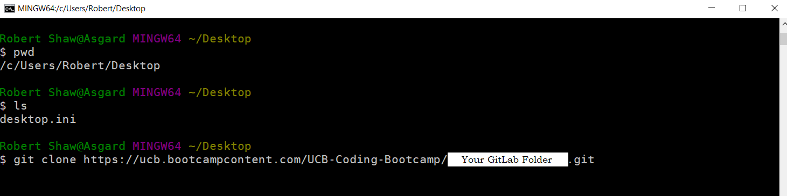
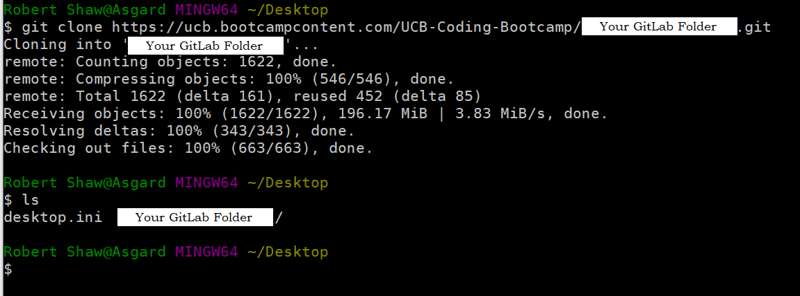

# Using Gitlab

 

### This will be a tutorial on how to utilise the gitlab repository and how to grab the updated class material everyday. There will be 3 sections in this tutorial:

* The first section will be for updating and using a repository you have already downloaded. 
* The second section will be for resolving and solving errors you run across.
* The third section is for downloading the repository for the first time or if you ran into an error and need to reset your repository

### Please ensure you carefully follow all the steps in the second section to avoid running into errors.

 

## Downloading the repository

1. Navigate to your gitlab. It should look something like this: 

    * If your screen does not look like the screenshot, You can navigate back to that page by clicking this link:
    

 

2. Then, copy the git clone link here: 

 

3. Navigate to your Desktop or any other easily accessible directory. We are going to be storing the folder here, and we will need to navigate here through the terminal regularly, so keep it somewhere easy to get to!

 

4. Then, use the `git clone` command with the link we copied in step 2: 

    * This will copy down all the current class material

    * Since we are downloading the entirety of the class material this will take longer and longer as we get deeper into the class. So, we will be maintaining this repository instead of downloading everything again and again.

5. Once you have finished downloading the repository, you are free to navigate inside the folder and follow the instructions given in section one for updating and creating working directories.

 